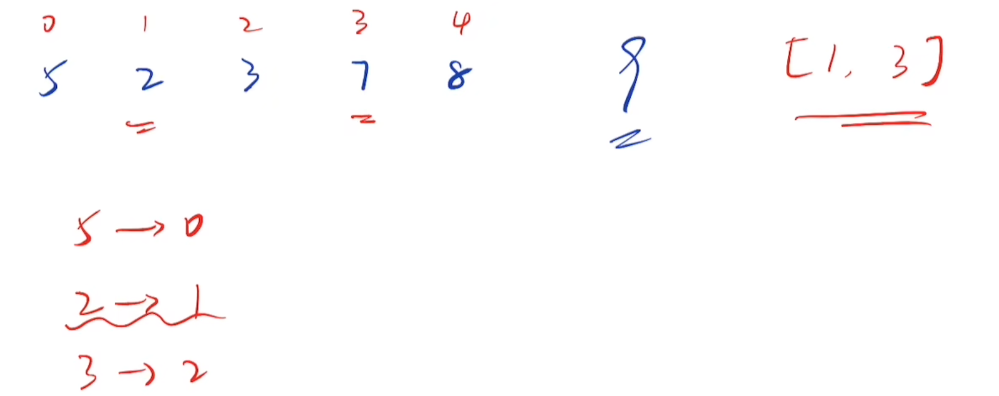
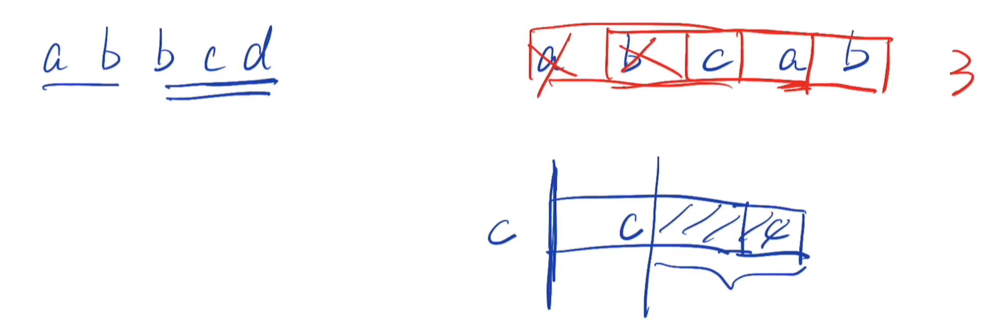
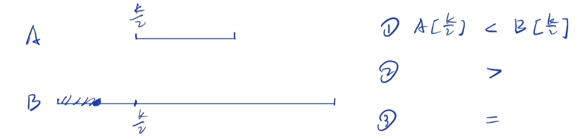

># ***Leetcode***

###  Question 1 [两数之和](/problems/1.两数之和.cpp)  *E*
- [x] [题解思路/解题流程](https://www.bilibili.com/video/BV1Xu411S7uo/?spm_id_from=333.788&vd_source=41cf0bf8fd5d0fd2788aa7ff7dd66abc)  
 
### Question 2 [两数相加](problems/2.两数相加.cpp) *M*
- [x] [题解思路/解题流程](https://www.bilibili.com/video/BV1Wi4y1R7P7/?spm_id_from=333.788&vd_source=41cf0bf8fd5d0fd2788aa7ff7dd66abc)
### Question 3 [无重复字符的最长子串](problems/3.无重复字符的最长子串.cpp) *M*
- [x] [题解思路/解题流程](https://www.bilibili.com/video/BV1GM4y1F7vn/?spm_id_from=333.788&vd_source=41cf0bf8fd5d0fd2788aa7ff7dd66abc)
  
### Question 4 [寻找两个正序数组的中位数](problems/4.寻找两个正序数组的中位数.cpp) *H*

- [x] [题解思路/解题流程](https://www.bilibili.com/video/BV1DL4y1E7ai/?spm_id_from=333.788&vd_source=41cf0bf8fd5d0fd2788aa7ff7dd66abc)
### Question 5 [最长回文子串](problems/5.最长回文子串.cpp) *E*
- [x] [题解思路/解题流程](https://www.bilibili.com/video/BV1UZ4y1U7tt/?spm_id_from=333.999.0.0&vd_source=41cf0bf8fd5d0fd2788aa7ff7dd66abc)
